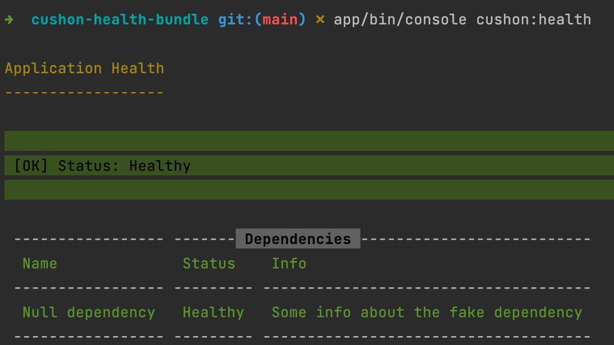

# Cushon Symfony Health Bundle
[](https://packagist.org/packages/Smarterly/symfony-health-bundle)
[](https://packagist.org/packages/cushon/health-bundle)
[](https://packagist.org/packages/cushon/health-bundle)
[](https://github.com/Smarterly/symfony-health-bundle/actions)
[](https://scrutinizer-ci.com/g/Smarterly/symfony-health-bundle/?branch=main)
[](https://codecov.io/gh/Smarterly/symfony-health-bundle)
[](https://sonarcloud.io/summary/new_code?id=Smarterly_symfony-health-bundle)
***

## Overview
This bundle provides a mini-framework for a [Symfony][symfony] application to be queried on it's current "health". The specifics of what "healthy" and "unhealthy" are depend on the application and must be defined. However, the boilerplate of creating Symfony Controllers and Console Commands to make a query (and provide a health report) are taken care of.
//
## Installation

The only supported method of installing the bundle is via [`composer`][composer]:

```bash
composer require cushon/health-bundle
```

### Recommended Packages and Extensions

Several libraries and packages are included in the `suggest` section of the `composer.jspn`. The bundle utilises the `Set` class of [PHP Data Structures][data-structures]. However, the [DS polyfill][php-ds-polyfill] is used to ensure that the bundle can run on a stack without the extension.

## Configuration

### API Error Response Code

When a service is deemed to be unhealthy, the API endpoint will return a 500 status code by default.
This is configurable by adding the following to your Symfony config YAML file:

```yaml
    cushon_health:
        error_response_code: !php/const Symfony\Component\HttpFoundation\Response::HTTP_SERVICE_UNAVAILABLE
```

Note that the above snippet illustrates an error response code of 503. You can specify any status code here, including a 200 if you wish.

## The Console Command

### Usage
```bash
bin/console cushon:health
```

An example of the output:



## The JSON Api Endpoint:

The default endpoint is available at `/health`.

## Getting Started

Please see the section on creating a [Dependency Check][dependency-check].

## Structure

### Directories used in production builds

[`/src`][src-dir]: Contains the bundle code. With minor deviations, this follows the standard design for the [Symfony Bundle System][symfony-bundle-system].

[`/docs`][docs-dir]: Collation of documentation and metrics for the project.

### Directories & Files Not Included In Releases

The following files and directories are not included in the release to reduce archive complexity. Should you want to see the entire project, you should either clone the project locally or choose not to prefer the distribution in your `composer` file.

[`/app`][app-dir] - Contains a Symfony 6 app for running integration and behavioural tests, and to provide examples

[`/docker`][docker-dir] - Contains Dockerfiles and nginx configuration to run the API example and used for testing against PHP versions. The [docker-compose.yml][docker-compose.yml] in the root of the project is similarly removed.

[`/features`][features-dir] - Contains [Gherkin][gherkin] simplified scenarions to drive behavioural testing and provide [specification by example][specification-by-example].

[`/tests`][tests-dir] - The tests are excluded when using a release.

Additionally, files to run testing and quality tooling (e.g. `infection.json`, `phpunit.xml.dist`) are also omitted.

## Testing & Quality
The bundle is tested with both unit testing and behavioural testing with [phpUnit][phpunit] and [behat][behat] respectively.

[](https://github.com/Smarterly/symfony-health-bundle/issues)
[](https://coveralls.io/github/Smarterly/symfony-health-bundle?branch=main)
[](https://sonarcloud.io/summary/new_code?id=Smarterly_symfony-health-bundle)
[](https://sonarcloud.io/summary/new_code?id=Smarterly_symfony-health-bundle)
[](https://sonarcloud.io/summary/new_code?id=Smarterly_symfony-health-bundle)
[](https://github.com/vshymanskyy/StandWithUkraine/)

[composer]: https://getcomposer.org/
[symfony]: https://symfony.com/
[phpUnit]: https://phpunit.readthedocs.io/
[behat]: https://docs.behat.org/
[gherkin]: https://cucumber.io/docs/gherkin/
[specification-by-example]: https://www.tutorialspoint.com/behavior_driven_development/bdd_specifications_by_example.htm
[data-structures]: https://www.php.net/manual/en/book.ds.php
[app-dir]: ./app
[docker-dir]: ./docker
[docs-dir]: ./docs
[features-dir]: ./features
[src-dir]: ./src
[tests-dir]: ./tests
[docker-compose.yml]: ./docker-compose.yml
[php-ds-polyfill]: https://packagist.org/packages/php-ds/php-ds
[symfony-bundle-system]: https://symfony.com/doc/current/bundles.html
[dependency-check]: ./docs/DEPENDENCY-CHECKS.md
