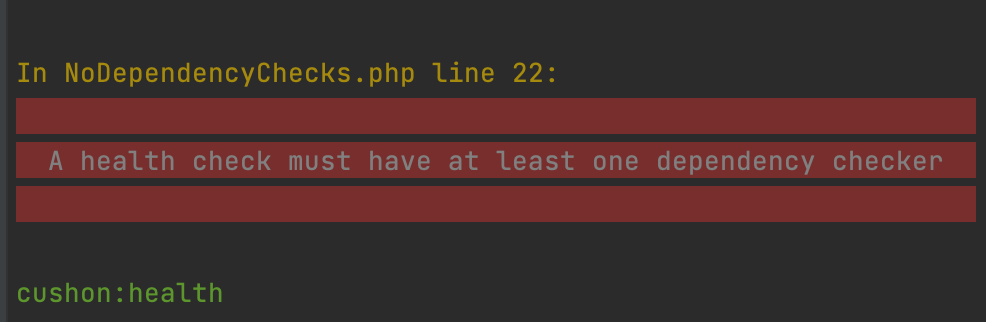

# Dependency Checks

## Theory of Operation

The bundle makes use of the Symfony Messenger component to query the health of a service or application. The health query is routed to a handler that creates a "Health Report" and returns this as a Health Check Result. The Result is then formatted based on whether the query was sent via a Console Command or API.

The default strategy for the bundle is the `Cushon\HealthBundle\ApplicationHealth\Dependencies\SimpleDependencies` class, which assumes that if one or more Dependencies are unhealthy, the application is Unhealthy. If you prefer more fine-grained decision-making over what constitutes health, you can write a different strategy that implements `Cushon\HealthBundle\ApplicationHealth\Dependencies`.

Out of the box, the Health bundle will error - because you haven't defined any Dependencies yet!

## What is a Dependency?

A _dependency_ in the context of the bundle is a high-level component underpinning capabilities of a service or application.

By the time your first feature or unit of functionality goes into production, you should have identified what dependencies need to be in place for it, and how to ensure you know they are still working _before_ they are needed. The Health bundle allows you to query these dependencies and see their health, rather than waiting for a problem to cause an alert.

Individual examples of separate dependencies include:

- Accessing a database with a read user
- Writing to a database table with a write user (assuming two separate users for design patterns such as [Command Query Segregation][command-query-segragation]).
- Contacting a partner API
- Retrieving a file from an S3 bucket.
- Able to send a message on a queue.

In all cases, a dependency check should:
- _be non-destructive_ - ie, don't test a write database user with a `TRUNCATE customers;` command.
- _have well known effects_ - does your partner API charge per query? If so, do you want to be checking every minute, 24/7?

## Writing a Dependency Check

All Dependency Checks should implement the interface `Cushon\HealthBundle\ApplicationHealth\DependencyCheck`. If you have `autoconfiguration` enabled in your Symfony project, then this is enough to have it picked up by the bundle, which will tag it as a `cushon_health.dependency_check`. The default Health Report strategy `SimpleDependencies` leverages Symfony's ability to pass tagged services to a Service Locator to automatically register the Dependency Check in the constructor.

[command-query-segragation]: https://en.wikipedia.org/wiki/Command%E2%80%93query_separation
